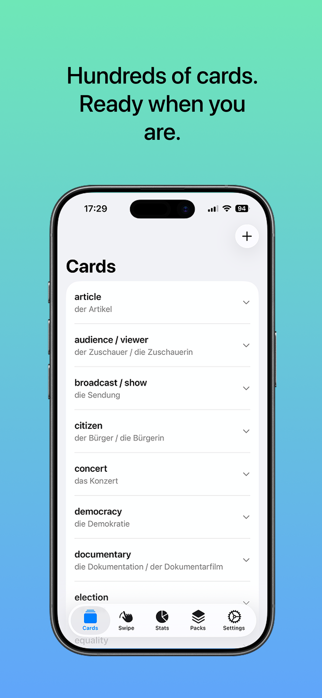
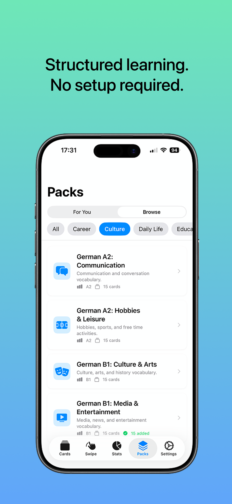

<div align="center">

# Flickard

**A modern flashcard learning app with swipe-based interaction**

[](https://swift.org)
[](https://developer.apple.com/xcode/swiftui/)
[](https://developer.apple.com/documentation/swiftdata)
[](https://www.apple.com/ios/)
[](LICENSE)

---

*Swipe your way to knowledge*

</div>

## Overview

Flickard is an intuitive iOS flashcard application that transforms learning into an engaging experience. Using familiar swipe gestures, users can interact with flashcards in a fun, Tinder-like interface while tracking their progress through beautiful visualizations.

The app comes bundled with **36 vocabulary packs** for German-English learning, organized by CEFR difficulty levels (A1-C2). An AI-powered suggestion engine recommends cards tailored to your learning profile.

Whether you're learning a new language, studying for exams, or memorizing anything else — Flickard makes the process smooth and enjoyable.

## Features

### Swipe to Learn
Interact with flashcards using intuitive swipe gestures with haptic feedback. Swipe right when you know it, left when you don't. Tap to flip and reveal the answer.

### Smart Progress Tracking
Every swipe is recorded. Flickard maintains a history of your responses for each card, helping you identify which cards need more practice.

### Visual Statistics
Beautiful pie charts and detailed breakdowns show your learning progress at a glance. See which cards you've mastered and which need attention.

### Card Management
Create, edit, and organize your flashcards with ease. View swipe history for individual cards and track your improvement over time.

### Content Packs
Browse and add from 36 pre-built vocabulary packs covering German-English vocabulary at various CEFR difficulty levels:
- **A1 (Beginner):** Animals, Body Parts, Clothing, Colors & Numbers, Everyday Items, Family, Food & Drink, Greetings, School & Learning, Time & Calendar
- **A2 (Elementary):** City & Directions, Communication, Emotions, Health, Hobbies, Home & Living, Shopping, Travel, Weather, Work
- **B1 (Intermediate):** Business, Culture & Arts, Education, Environment, Law & Justice, Media, Relationships, Science, Society, Technology

### AI-Powered Suggestions
Personalized card recommendations based on your learning profile. The suggestion engine analyzes your swipe history, identifies weak areas, and recommends cards at the right difficulty level. Uses on-device AI (iOS 26+) with a smart heuristic fallback for older devices.

## Screenshots

<div align="center">
<table>
  <tr>
    <td align="center"><b>Swipe</b></td>
    <td align="center"><b>Cards</b></td>
    <td align="center"><b>Stats</b></td>
    <td align="center"><b>Stats</b></td>
    <td align="center"><b>Stats</b></td>
    <td align="center"><b>Stats</b></td>
  </tr>
  <tr>
    <td></td>
    <td></td>
    <td></td>
    <td></td>
    <td></td>
    <td></td>
  </tr>
</table>
</div>

## Tech Stack

| Technology | Purpose |
|------------|---------|
| **SwiftUI** | Declarative UI framework |
| **SwiftData** | Data persistence |
| **Charts** | Statistics visualization |
| **Combine** | Reactive state management |
| **FoundationModels** | On-device AI suggestions (iOS 26+) |
| **OSLog** | Structured logging |

## Project Structure

```
Flickard/
├── FlickardApp.swift              # App entry point & model container
├── Models/
│   ├── Card.swift                 # User's flashcard data model
│   ├── ContentPack.swift          # Pack metadata & difficulty levels
│   ├── PackCard.swift             # Card within a content pack
│   └── UserPackProgress.swift     # Track added pack cards
├── Views/
│   ├── ContentView.swift          # Main tab navigation
│   ├── SwipeableCardsView.swift   # Swipe interaction interface
│   ├── CardView.swift             # Flippable card component
│   ├── CardsListView.swift        # Card management list
│   ├── StatsView.swift            # Statistics dashboard
│   ├── CreateCardView.swift       # New card form
│   ├── CardEditView.swift         # Edit card form
│   ├── SettingsView.swift         # App settings
│   └── ContentPacks/
│       ├── ContentPacksTabView.swift   # Pack hub with tabs
│       ├── ContentPacksView.swift      # Browse all packs
│       ├── PackDetailView.swift        # Individual pack details
│       └── SuggestionsView.swift       # AI recommendations
├── Stores/
│   └── CardStore.swift            # Data access layer
├── Services/
│   ├── ContentPackLoader.swift    # Bundle JSON loader with caching
│   └── SuggestionEngine.swift     # AI/heuristic recommendation engine
└── ContentPacks/
    ├── pack-manifest.json         # List of all available packs
    └── *.json                     # 36 vocabulary pack files
```

## Requirements

- iOS 17.0+
- Xcode 15.0+
- Swift 5.9+

## Installation

1. **Clone the repository**
   ```bash
   git clone https://github.com/ygteker/Flickard.git
   ```

2. **Open in Xcode**
   ```bash
   cd Flickard
   open Flickard.xcodeproj
   ```

3. **Build and run**

   Select your target device or simulator and press `Cmd + R`

## Usage

### Creating Cards
Tap the `+` button in the Cards tab to create a new flashcard. Enter the front (question) and back (answer) content.

### Adding Content Packs
Navigate to the Packs tab to browse pre-built vocabulary:
- **For You** — AI-powered personalized recommendations
- **Browse** — Explore all packs organized by difficulty level

### Studying
Navigate to the Swipe tab and start learning:
- **Tap** a card to flip it
- **Swipe right** if you knew the answer
- **Swipe left** if you didn't
- Review your progress in the Stats tab

### Tracking Progress
Each card maintains a history of your last 10 swipes, visualized as a colored bar in the Cards list. Green indicates correct responses, red indicates incorrect ones.

## Architecture

Flickard follows a clean architecture pattern with clear separation of concerns:

- **Models** — Data structures with SwiftData persistence
- **Views** — SwiftUI components with declarative UI
- **Stores** — Data access and business logic layer
- **Services** — Specialized services (content loading, AI suggestions)

The app leverages SwiftData's `@Model` macro for automatic persistence and SwiftUI's `@Query` for reactive data binding.

## Contributing

Contributions are welcome! Please feel free to submit a Pull Request.

1. Fork the repository
2. Create your feature branch (`git checkout -b feature/amazing-feature`)
3. Commit your changes (`git commit -m 'Add amazing feature'`)
4. Push to the branch (`git push origin feature/amazing-feature`)
5. Open a Pull Request

## License

This project is licensed under the MIT License — see the [LICENSE](LICENSE) file for details.

## Acknowledgments

- Built with Apple's modern frameworks
- Inspired by spaced repetition learning techniques
- CEFR difficulty levels for structured language learning progression

---

<div align="center">

**Made with SwiftUI**

</div>
